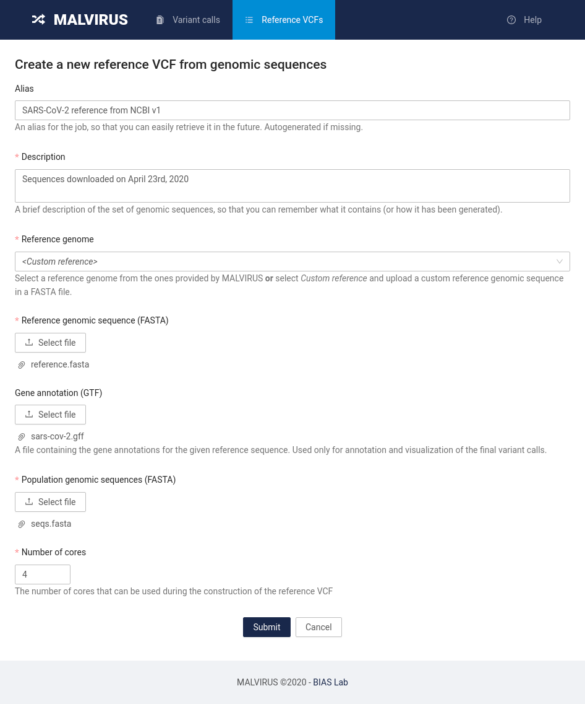
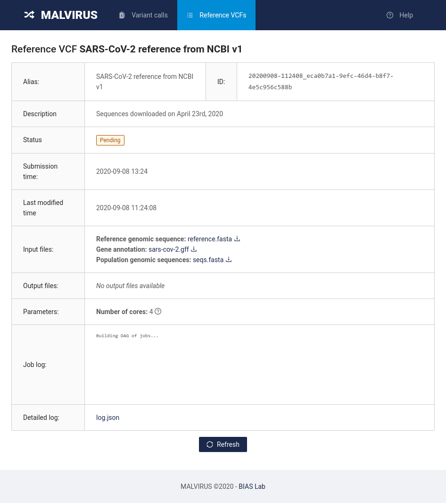
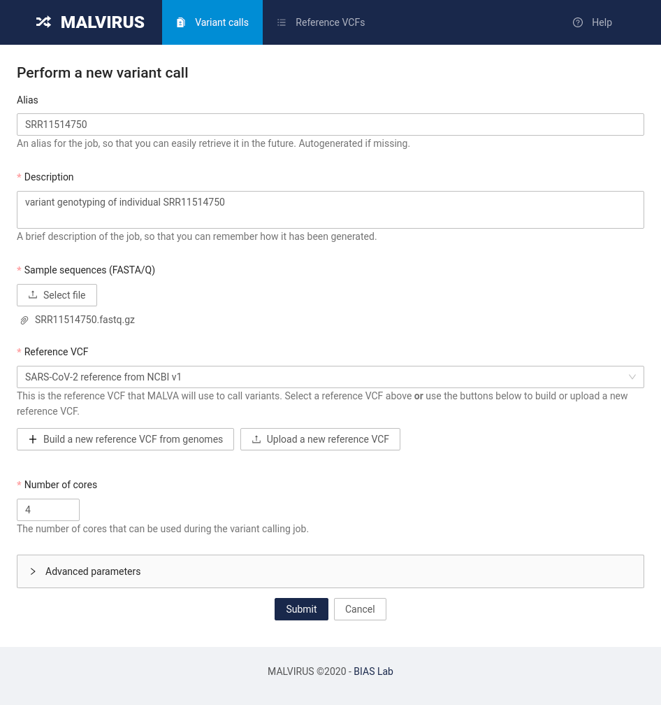
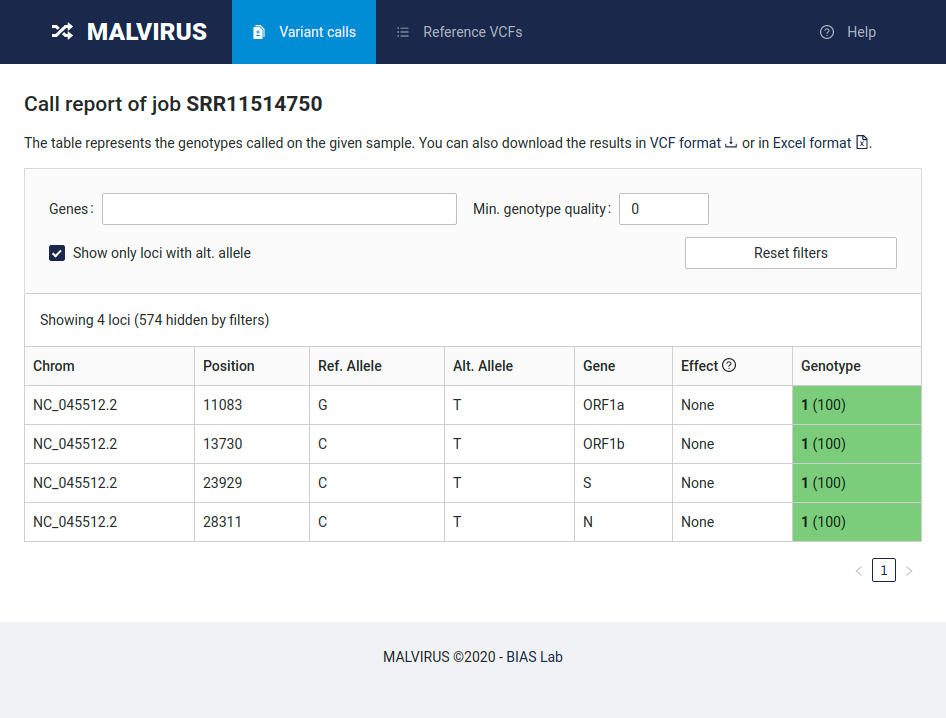

# Tutorial

# Table of contents
1. [Introduction](#introduction)
2. [Download the data](#download-the-data)
3. [Create an index from the data](#create-an-index-from-the-data)
4. [Genotype imputation](#genotype-imputation)

## Introduction

This quick tutorial will guide you through your first use of MALVIRUS, showing you how to create an index of known variants and how to call variants for an individual, directly from the sequencing dataset.

First, we will need the reference genome of the species we want to analyze, some additional assemblies that differ from the reference genome, and some data to analyze.

## Download the data

We will use data from SARS-CoV-2.

The data you will need for this tutorial is conveniently available at [this GitHub repo](https://github.com/algolab/MALVIRUS-tutorial-data); either [download the data as a ZIP file](https://github.com/AlgoLab/MALVIRUS-tutorial-data/archive/master.zip) on your PC or clone the repository using git:

```bash
git clone https://github.com/algolab/MALVIRUS-tutorial-data
```

The data include the complete genome of SARS-CoV-2 isolate Wuhan-Hu-1 (accession id: `NC_045512.2`) in file `reference.fasta`, its annotation in file `sars-cov-2.gff`, a set of SARS-CoV-2 complete genomes in file `seqs.fasta`, and an Illumina sequencing dataset of SARS-CoV-2 Malaysia using the ARTIC v1 protocol (SRA accession id: `SRR11514750`) in file `SRR11514750.fastq.gz`.

## Create an index from the data

First we will create the index of known variants induced by the data we downloaded.

Head to the "Reference VCF" tab and click on the "Build a new Reference VCF from genomes" button.

You will be presented with a submission form similar to the following



Fill in the information as follows:

* **Alias**: SARS-CoV-2 reference from NCBI v1
* **Description**: Sequences downloaded on April 23rd, 2020
* **Reference**: click the _Select file_ button and select the `reference.fasta` file in the git repository we cloned previously
* **Gene annotation**: click on the _Select file_ button and select the `sars-cov-2.gff` file in the git repository we cloned previously
* **Population genomic sequences**: click on the _Select file button_ and select the `seqs.fasta` file in the git repository we cloned previously
* **Number of cores**: set this value based on how many cores are available on your machine; setting this value to 4 is usually enough.

Once you filled in all the field with the data, click on the _Submit_ button at the bottom of the page.
You will be redirected to a page reporting the status of the job requested.



To update the status, click on the _Refresh_ button at the bottom of the page.
The status will change from "Pending" to "Running" to "Completed".
Once the status is "Completed", congratulations! You just built your first MALVIRUS index.
Let's now head to genotyping the individual by clicking on the "Variant calls" tab at the top of the page.

## Genotype imputation

Head to the "Variant calls" tab and click on the "Perform a new variant call" button.

You will be presented with a submission form similar to the following



Fill in the information as follows:

* **Alias**: SRR11514750
* **Description**: variant genotyping of individual SRR11514750
* **Sample sequences (FASTA/Q)**: click on the _Select file_ button and select the `SRR11514750.fastq.gz` file
* **Reference VCF**: click on the bar and select the "SARS-CoV-2 reference from NCBI v1" entry
* **Number of cores**: set this value based on how many cores are available on your machine; setting this value to 4 is usually enough

Other parameters are available in the "Advanced parameters" section.
We will use the default values and will not change them for now.

Finally, click the _Submit_ button at the bottom of the page.

Similarly to the previous step, you will be redirected to a page reporting the status of the job requested.
To update the status, click on the _Refresh_ button at the bottom of the page.
The status will change from "Pending" to "Running" to "Completed".
Once the status is "Completed", congratulations! You just completed your first genotype imputation using MALVIRUS.

## Accessing the results

To access the results, head back to the "Variant calls" tab where you will find the list of jobs submitted to MALVIRUS.
You will be presented with a table containing a single entry (`SRR11514750`).


By clicking on the job alias you will be redirected to the job status page.


In this page you will be able to access the results by clicking on the _Show in tabular form_ button in the "Output files" row.

By default the table in this view will only show the variants genotyped as wild type, by deselecting the "Show only loci with alt. allele" filter you will be able to analyze all the variants genotyped in this run.



Finally, you can download the data both as VCF and in Excel format by clicking the links at the top of the page.
